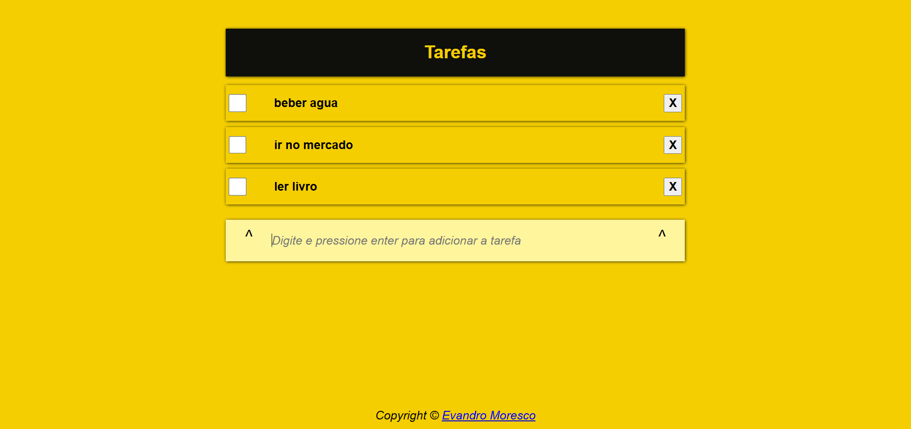

# 📝 Lista de Tarefas

Uma aplicação web simples e objetiva para organizar suas tarefas do dia a dia, desenvolvida com HTML, CSS e JavaScript puro.

## 🖥️ Preview



> 🔗 **Acesse o projeto online:** [mor3sco.github.io/lista-de-tarefas](https://mor3sco.github.io/lista-de-tarefas/)

---

## ✨ Funcionalidades

- ✅ Adicionar novas tarefas digitando e pressionando **Enter**
- ☑️ Marcar tarefas como concluídas com checkbox
- ❌ Remover tarefas individualmente com o botão **X**
- 💾 Interface leve e sem dependências externas

---

## 🛠️ Tecnologias Utilizadas

| Tecnologia | Descrição |
|------------|-----------|
|  | Estrutura e marcação da página |
|  | Estilização e layout visual |
|  | Lógica de interação e manipulação do DOM |

---

## 📁 Estrutura do Projeto

```
lista-de-tarefas/
├── index.html      # Estrutura principal da aplicação
├── style.css       # Estilização da interface
├── app.js          # Lógica da aplicação (adicionar, remover e marcar tarefas)
└── README.md       # Documentação do projeto
```

---

## 🚀 Como Executar Localmente

1. Clone o repositório:
   ```bash
   git clone https://github.com/mor3sco/lista-de-tarefas.git
   ```

2. Acesse a pasta do projeto:
   ```bash
   cd lista-de-tarefas
   ```

3. Abra o arquivo `index.html` no seu navegador — sem necessidade de servidor ou instalação.

---

## 💡 Aprendizados

Este projeto foi desenvolvido para praticar e consolidar os fundamentos do desenvolvimento web front-end:

- Manipulação do **DOM** com JavaScript puro
- Captura de **eventos** do teclado e do mouse
- Criação e remoção dinâmica de **elementos HTML**
- Organização básica de projeto web sem frameworks

---

<p align="center">
  Feito por <a href="https://github.com/mor3sco"><strong>Evandro Moresco</strong></a>
</p>
